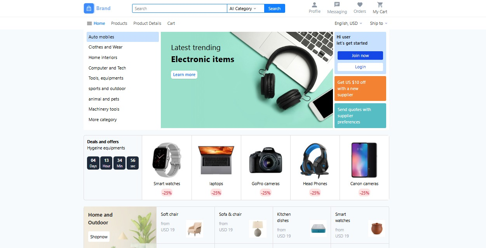
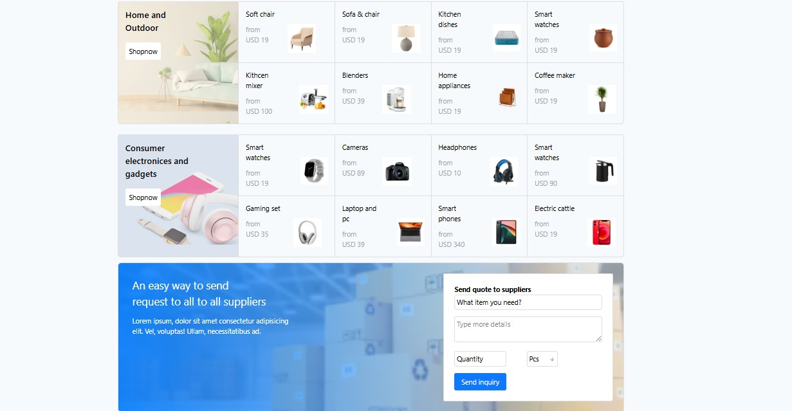
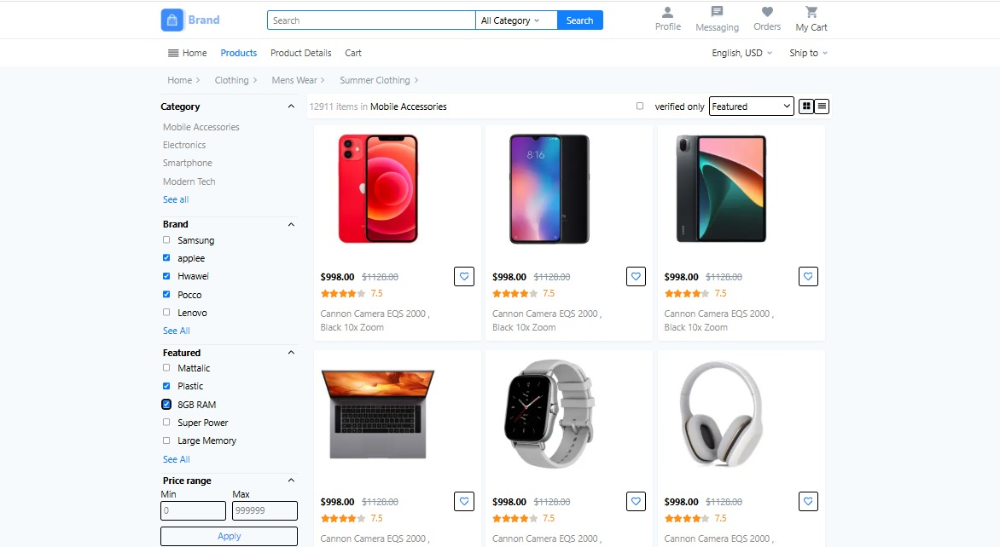
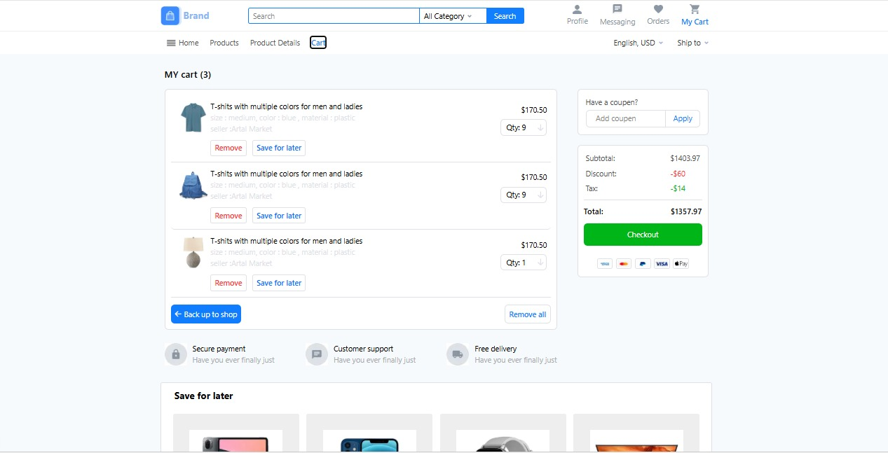

## 🛒 E-Commerce Frontend Website

<p align="center">
  <strong>A modern E-Commerce frontend built using Next.js, React.js, JavaScript, HTML5 and CSS3.</strong>
</p>

---

## 📖 Overview

This is a modern e-commerce frontend application developed using **React.js**, **JavaScript**, **HTML5**, and **CSS3**. The project focuses on delivering a clean user interface and smooth user experience with reusable React components.

---

## ✨ Features

- 🛒 Product Listing
- 📄 Product Details Page
- 🛍️ Shopping Cart
- 🔍 Clean & Modern UI
- ⚡ Fast Performance
- ♻️ Reusable Components

---


## 🛠️ Technologies Used

 Next.js  
 React.js  
 JavaScript (ES6+)  
 HTML5  
 CSS3
---

## 🚀 Installation

```bash
git clone https://github.com/kWD36768/My-Frontend-project.git

cd My-Frontend-project
npm install
npm run dev
```

---

## 📸 Screenshots

### 🏠 Home Page







### 🏠 products Page



### 🛒 Cart Page



---

## 🌐 Live Demo

🔗 https://my-frontend-project-fawn.vercel.app

---

## 👨‍💻 Author

**Muhammad Bilal**

- GitHub: https://github.com/kWD36768
- LinkedIn: www.linkedin.com/in/muhammad-bilal-a00aa7336

---

⭐ If you like this project, don't forget to **Star** this repository.
